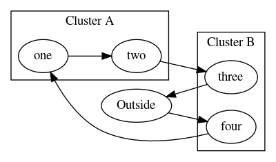

## dot - little helper package in Go for the graphviz dot language

This is a modified fork of the [great project](https://github.com/emicklei/dot/) made by [Ernest Micklei](https://github.com/emicklei). 

[DOT language](http://www.graphviz.org/doc/info/lang.html)

	package main
	
	import (
		"fmt"	
		"github.com/lucasepe/dot"
	)
	
	// go run main.go | dot -Tpng  > test.png && open test.png
	
	func main() {
		g := dot.NewGraph(dot.Directed)
		n1 := g.Node(WithLabel("coding"))
		n2 := g.Node(WithLabel("testing a little")).Box()
	
		g.Edge(n1, n2)
		g.Edge(n2, n1, WithLabel("back")).Attr("color", "red")
	
		fmt.Println(g.String())
	}

Output

	digraph {
		node [label="coding"]; n1;
		node [label="testing a little"];
		n1 -> n2;
		n2 -> n1 [color="red", label="back"];
	}

Subgraphs

	s := g.NewSubgraph()
	s.Attr("label", "My Subgraph")
	s.Attr("style","filled")

HTML and Literal values

	node.Attr("label", Literal(`"left-justified text\l"`))
	graph.Attr("label", HTML("<B>Hi</B>"))

Nodes Global Attributes

    g := dot.NewGraph(dot.Directed)
	g.NodeBaseAttrs().Attr("shape", "plaintext").Attr("color", "blue")
	// Override shape for node `A`
	n1 := g.Node(WithLabel("A")).Attr("shape", "box")

## cluster example

	di := dot.NewGraph(dot.Directed)
	di.Attr("rankdir", "LR")
	outside := di.Node(dot.WithLabel("Outside"))

	// A
	clusterA := di.NewSubgraph()
	clusterA.Attr("label", "Cluster A")

	insideOne := clusterA.Node(dot.WithLabel("one"))
	insideTwo := clusterA.Node(dot.WithLabel("two"))

	// B
	clusterB := di.NewSubgraph()
	clusterB.Attr("label", "Cluster B")

	insideThree := clusterB.Node(dot.WithLabel("three"))
	insideFour := clusterB.Node(dot.WithLabel("four"))

	di.Edge(outside, insideFour)
	di.Edge(insideFour, insideOne)
	di.Edge(insideOne, insideTwo)
	di.Edge(insideTwo, insideThree)
	di.Edge(insideThree, outside)

## About dot attributes

https://graphviz.gitlab.io/_pages/doc/info/attrs.html

## display your graph

	go run main.go | dot -Tpng  > test.png && open test.png

